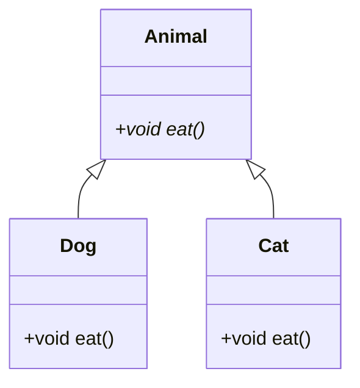
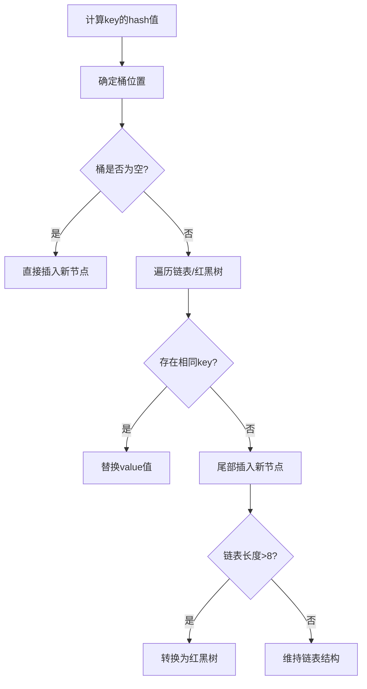

## 一、面向对象
### 1.1 面向对象三大特性
#### Q1：封装的意义及实现方式？

**答案**：

- **核心思想**：隐藏对象内部细节，对外暴露安全访问接口
- **实现方式**：
  
```java
  public class Person {
      // 私有化属性
      private String name;
      
      // 提供公共访问方法
      public String getName() { return name; }
      public void setName(String name) { 
          if(name != null) this.name = name;
      }
  }
```

**应用场景：**

- DTO数据传输对象设计

- 模块接口定义

- 敏感数据保护

**Q2：多态的实现原理？**

**答案：**

**技术实现：**

- 方法重写（Override）
- 向上转型（父类引用指向子类对象）
- 动态绑定（运行时确定具体方法）

**JVM实现机制：**



## 二、集合框架

### 2.1 HashMap深度解析

**Q3：HashMap的put方法执行流程？**

**答案：**



**Q4：ConcurrentHashMap线程安全实现演进？**

**版本对比：**

